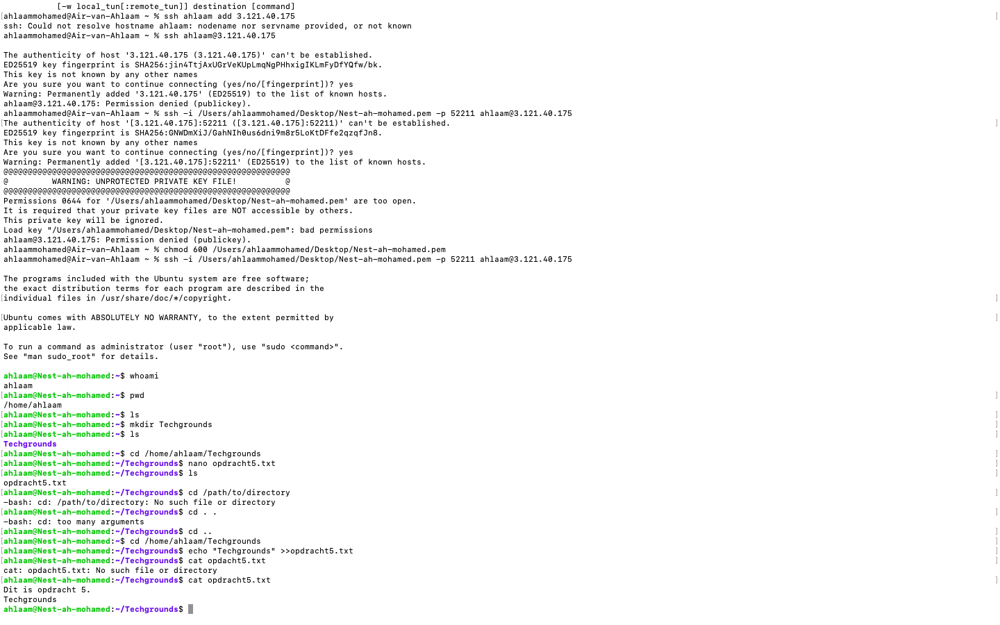

# Files and directories

## Samenvatting
Het Linux-bestandssysteem begint bij de root-directory, die wordt weergegeven door een schuine streep (/). Alle bestanden en mappen in Linux worden gerepresenteerd door hun pad, beginnend vanaf de root.

Het tilde-teken (~) wordt gebruikt als een alias voor je thuismap.

## Key-terms

input: Het verwijst naar de gegevens of instructies die worden ingevoerd in een programma, opdracht of script om een specifieke taak uit te voeren.

output: Het verwijst naar de informatie of resultaten die een programma, opdracht of script genereert en weergeeft op het scherm of op een andere bestemming.

pwd: Het toont het volledige pad naar de huidige directory, wat handig is om te weten waar je je in het bestandssysteem bevindt.

cd: Je kunt cd gebruiken om naar een specifieke directory te gaan door het pad op te geven, bijvoorbeeld cd /pad/naar/map, of je kunt naar een bovenliggende map gaan met cd ..

## Opdracht
In deze opdracht laat ik zien hoe ik de huidige werkdirectory heb geïdentificeerd. Ook maak ik een lijst van alle bestanden en mappen in de thuismap. Binnen de thuismap is een nieuwe map met de naam 'techgrounds' aangemaakt. In de 'techgrounds' map is een nieuw bestand gemaakt met wat tekst erin.

STAP 1: `home directory`

Ik moet starten in mijn home directory, met de pwd commando zie je dat ik mij daar al in bevind. Mocht dit niet het geval zijn geweest dan zou ik met de `cd~` naar de home directory gaan.

STAP 2: `mkdir` 

Dit maakt het mogelijk om een map aan te maken in de huidige directory. De opdracht was om een techgrounds map aan te maken, dus ik heb dit ingevoerd: mkdir Techgrounds.

STAP 2: `ls`

Hiermee check ik de inhoud van de huidige directory inclusief bestanden en mappen. In mijn screenshot zie je dat ik het bestand Techgrounds heb aangemaakt.

STAP 3: `cd/home/ahlaam/Techgrounds`

Hiermee bevind ik mij in de Techgrounds map die ik zojuist heb aangemaakt.

STAP 4: `echo "Techgrounds" >>opdracht5.txt`

Hiermee noteer ik met de teksteditor de volgende tekst in de Techgrounds map: Dit is opdracht 5.

STAP 5: `cat opdracht 5.txt`

Dit zorgt ervoor dat ik de inhoud van de map kan bekijken. 

## Gebruikte bronnen
- https://www.bien.nl/linux_voor_de_beginnende_beheerder-Directory_structuur.blog

## Ervaren problemen
Niet van toepassing.

## Resultaat
De directorystructuur is verkend door zowel absolute (volledige) paden als relatieve paden te gebruiken om te navigeren binnen het bestandssysteem.

