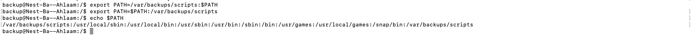

# Bash scripts

## Samenvatting
Een Bash-script is een tekstbestand met een reeks opdrachten die kunnen worden uitgevoerd in de Bash-shell. Het biedt de mogelijkheid om automatische taken en procedures te definiëren en uit te voeren in een opdrachtregelomgeving.

De standaard opdrachtregelinterface in Linux wordt een Bash-shell genoemd.


## Key-terms
**PATH-omgevingsvariabele** 

De onderstaande commando laat zien wat de huidige shell is:
```
echo $SHELL
```

De onderstaande commando laat zien wat de inhoud is van de PATH-variabele:

```
echo $PATH
```
Het geeft je een lijst van directory-paden waarin het besturingssysteem zoekt naar uitvoerbare bestanden wanneer je een opdracht uitvoert in de terminal. Zo laat het dus zien waar het systeem zoekt om uitvoerbare programma's te vinden zonder dat je het volledige pad hoeft op te geven.

`Let op:` 
*Linux kan het script alleen vinden als je het pad opgeeft, of als je het pad naar de map waarin het script zich bevindt toevoegt aan de PATH-variabele.*

## Opdracht
**Opdracht 1:**
1. Maak een map genaamd 'scripts'. Plaats alle scripts die je maakt in deze map.
2. Voeg de scripts-map toe aan de PATH-variabele.
3. Maak een script dat het httpd-pakket installeert, httpd activeert en httpd inschakelt. Ten slotte moet je script de status van httpd in de terminal weergeven.



**Opdracht 2:**

Maak een script dat een willekeurig getal tussen 1 en 10 genereert, het in een variabele opslaat en vervolgens dit getal toevoegt aan een tekstbestand.

**Opdracht 3:**

Maak een script dat een willekeurig getal tussen 1 en 10 genereert, dit in een variabele opslaat, en het getal toevoegt aan een tekstbestand als het groter is dan 5. Als het getal 5 of kleiner is, voegt het script een tekstregel toe aan het tekstbestand met de boodschap "het getal is 5 of kleiner".


## Gebruikte bronnen
- https://ryanstutorials.net/bash-scripting-tutorial/bash-script.php

## Ervaren problemen
Niet van toepassing.


