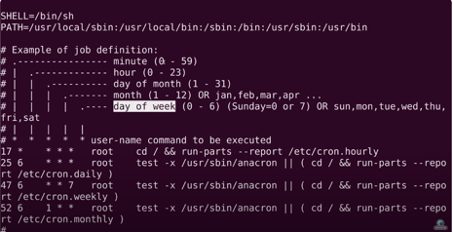

# Cron jobs

## Samenvatting
Er kunnen processen zijn die je op regelmatige basis wilt uitvoeren. Dit soort taken kunnen worden geautomatiseerd met behulp van Cron-taken.

## Key-terms

**Crontab**

 Dit is een bestand waarin je geplande taken (dus cronjobs) kunt definiëren die op regelmatige tijdstippen moeten worden uitgevoerd.


Voorbeeld: 



Bron afbeelding: https://www.youtube.com/watch?v=v952m13p-b4

**Uitleg:**

`Eerste kolom staat voor minuten`

`Tweede kolom staat voor uren`

`De derde kolom staat voor de dagen van de maand`

`Vierde kolom staat voor de maand`

`Vijfde kolom staat voor de dagen van de week`

Hiermee kun je dus de tijd en frequentie aanpassen door de getallen in de cronjob aan te passen aan je specifieke behoeften.


De onderstaande commando wordt gebruikt om de crontab van de huidige gebruiker te bewerken. 
```
crontab -e
``` 


## Opdracht
1. Maak een Bash-script dat de huidige datum en tijd schrijft naar een bestand in je thuismap.
2. Registreer het script in je crontab zodat het elke minuut wordt uitgevoerd.
3. Gebruik een cronjob zodat het wekelijks wordt uitgevoerd.


## Gebruikte bronnen
- https://www.youtube.com/watch?v=v952m13p-b4


## Ervaren problem

## Resultaat
