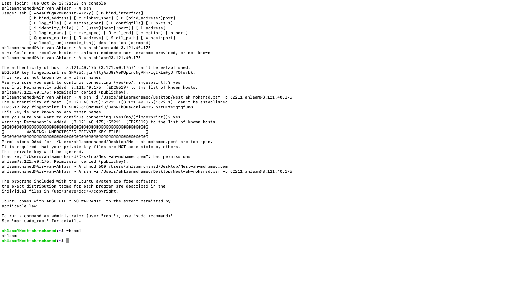

# Instellen SSH-verbinding met virtuele machine

## Samenvatting
Een **SSH-verbinding** (Secure Shell) is een beveiligde methode om op afstand toegang te krijgen tot een virtuele machine (VM) of een ander systeem. Met SSH kun je commando's uitvoeren en bestanden overdragen via een versleutelde verbinding.

## Key-terms
#### **Permissies:**
Permissies in Linux verwijzen naar de regels die bepalen wie welke acties mag uitvoeren met betrekking tot bestanden en mappen op het systeem. Hier gebruik je de **chmod commando** voor.

**u (user):** Verwijst naar de eigenaar van het bestand.

**g (group):** Verwijst naar de groep van het bestand.

**o (others):** Verwijst naar alle anderen.
```
Er zijn drie soorten bestandsrechten:

r (read): Leesrechten.

w (write): Schrijfrechten.

x (execute): Uitvoeringsrechten.
```

Om de rechten voor verschillende categorieën van gebruikers te wijzigen, wordt "u" gebruikt voor gebruikers (eigenaar), "g" voor de groep, en "o" voor anderen. "ugo" vertegenwoordigt alle categorieën, terwijl "a" ook alle categorieën aanduidt.

Bijvoorbeeld --> chmod o-rwx mapnaam: Dit verwijdert lees-, schrijf- en uitvoeringsrechten voor anderen (niet de eigenaar of de groep) voor de genoemde map.
```
Bestandspermissies uitgedrukt in binair stelsel:

0 = --- Niemand heeft enige rechten op het bestand (inclusief de eigenaar). 

1 = --x  Alleen uitvoeringsrechten zijn toegestaan.

2 = -w- Alleen schrijfrechten zijn toegestaan. 

3 = -wx- Zowel schrijfrechten als uitvoeringsrechten zijn toegestaan.

4 = r- Alleen leesrechten zijn toegestaan.

5 = r-x  Leesrechten en uitvoeringsrechten zijn toegestaan.

6 = rw- Zowel leesrechten als schrijfrechten zijn toegestaan.

7 = rwx Alle rechten zijn toegestaan. 
```


## Opdracht
In deze opdracht laat ik zien hoe ik een SSH-verbinding maak met een virtuele machine. Verder geef ik ook permissies. 



STAP 1: `ssh gebruikersnaam@IP-adres` 

In mijn terminal voer ik ssh ahlaam@3.121.40.175  in. 

STAP 2: `Inloggen`

Daarna probeer ik in te loggen door het volgende in te voeren: 

ssh -i /Users/ahlaammohamed/Desktop/Nest-ah-mohamed.pem -p 52211 ahlaam@3.121.40.175

STAP 3: `chmod 600` (permissies)

Ik krijg een waarschuwing (bad permission) en om dit op te lossen pas ik de commando chmod 600 toe. 

chmod 600 /Users/ahlaammohamed/Desktop/Nest-ah-mohamed.pem. Daarna probeer ik opnieuw in te loggen.

STAP 4: `whoami` 

Hiermee laat ik zien dat deze verbinding is gelukt en dat ik de huidige gebruiker (ahlaam) ben die is ingelogd.


### Gebruikte bronnen
- https://www.ssh.com/academy/ssh/command 

- https://www.pluralsight.com/blog/it-ops/linux-file-permissions 


### Ervaren problemen
Bad permission: Ik was 


### Resultaat
Ik heb geleerd welke stappen ik moet zetten om in te loggen in mijn VM. Daarnaast geef ik permissies m.b.v. chmod commando.


