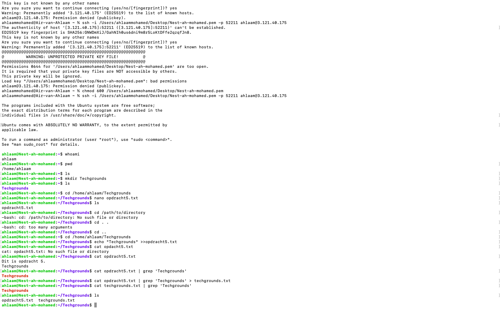

# Working with text (CLI)

## Samenvatting
Elke opdracht in Linux heeft een standaardinvoer en -uitvoer.
De standaardinvoer (stdin) is het toetsenbord. De standaarduitvoer (stdout) is het terminalvenster. 

## Key-terms
 `Pipe` `(|)`: kan worden gebruikt om de uitvoer van één opdracht als invoer voor een andere opdracht te gebruiken.

 ## Opdracht
 Opdracht 1: Gebruik het echo-commando en uitvoeromleiding om een nieuwe zin in je tekstbestand te schrijven met de opdrachtregel. De nieuwe zin moet het woord 'techgrounds' bevatten.

Opdracht 2: Gebruik een opdracht om de inhoud van je tekstbestand naar het terminalvenster te schrijven. Maak gebruik van een opdracht om de uitvoer te filteren zodat alleen de zin met 'techgrounds' verschijnt.

Opdracht 3: Lees je tekstbestand met de opdracht die in de tweede stap is gebruikt, en filter opnieuw op het woord 'techgrounds'. Deze keer, leid de uitvoer om naar een nieuw bestand met de naam 'techgrounds.txt'.

Zie onderstaande screenshot voor het resultaat: 

 ## Gebruikte bronnen
 - https://www.guru99.com/linux-pipe-grep.html

 - https://medium.com/@ayogun/pipe-grep-and-sort-command-in-linux-unix-with-examples-b53e6dd27ac0

 ## Ervaren problemen
Niet van toepassing.

 ## Resultaat
 Opdracht succesvol afgerond.