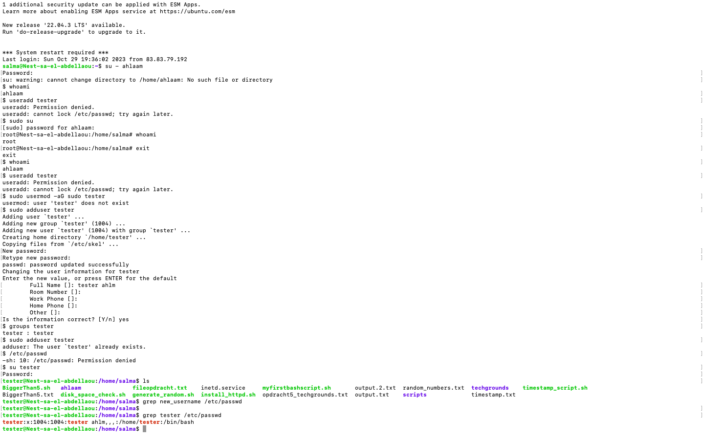
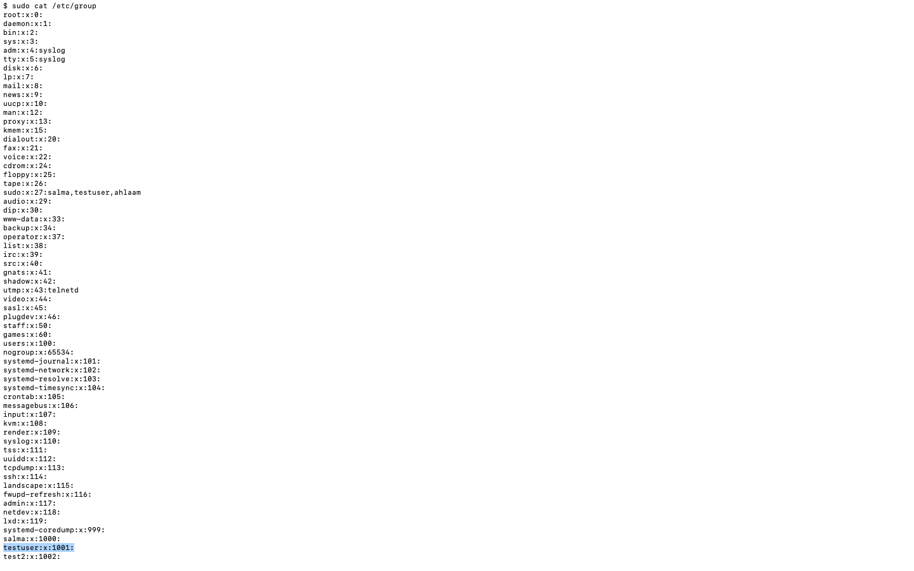
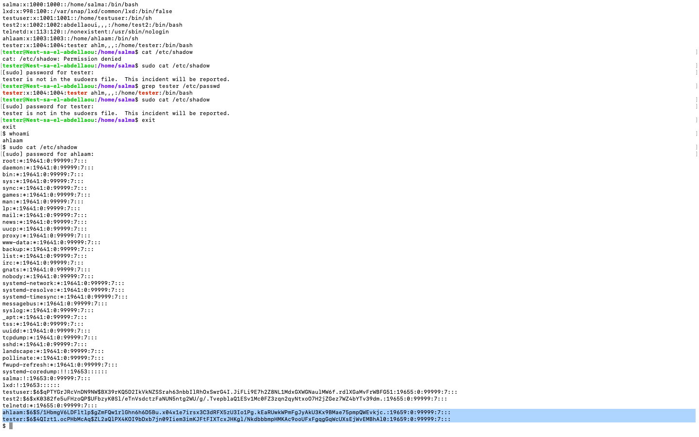

# Users and Groups

## Samenvatting
Linux heeft gebruikers, vergelijkbaar met accounts op Windows en MacOS. Elke gebruiker heeft zijn eigen thuismap. Gebruikers kunnen ook deel uitmaken van groepen.

Er is een speciale gebruiker genaamd 'root'. Root heeft toestemming om alles te doen.

## Opdracht
Opdracht 1: Creëer een nieuwe gebruiker op je virtuele machine (VM).

Door `sudo adduser tester` te gebruiken voeg ik de gebruiker met de naam Tester toe.

Opdracht 2: De nieuwe gebruiker moet deel uitmaken van een admin-groep.
Door `sudo usermod -aG sudo tester` te gebruiken voeg ik de gebruiker tester toe aan de admin-groep.

Opdracht 3: De nieuwe gebruiker moet een wachtwoord hebben.
Door `sudo passwd tester` te gebruiken maak ik een wachtwoord aan voor deze gebruiker.

Opdracht 4: De nieuwe gebruiker moet 'sudo' kunnen gebruiken.

In opdracht 2 heb ik de tester al sudo-rechten gegeven.

Opdracht 5: Zoek de bestanden op waarin gebruikers-, wachtwoord- en groepsgegevens worden opgeslagen. Zoek daar de gegevens van de nieuw aangemaakte gebruiker.

Om de bestanden te vinden waarin gebruikers-, wachtwoord- en groepsgegevens worden opgeslagen, kun je de volgende bestanden controleren:

Gebruikersinformatie: `cat /etc/passwd`

Groepsinformatie: `cat /etc/group`

Wachtwoordinformatie (gecodeerd): `/etc/shadow`

## Gebruikte bronnen
- https://www.linode.com/docs/guides/linux-users-and-groups/

## Ervaren problemen
Vanaf dit moment kon ik niet meer inloggen op mijn VM. Dit heb ik ook kenbaar gemaakt bij de learning coaches, maar er kon geen oplossing worden gevonden. Ik heb tijdelijk dit account (ahlaam) mogen gebruiken van mijn groepsgenoot Salma die mij sudo-rechten heeft gegeven. Vandaar dat haar naam ook in de screenshots vermeld staan.

## Resultaat
Ik heb meer kennis opgedaan over gebruikers, wachtwoorden en groepen die allemaal op verschillende bestanden verspreid over het systeem worden opgeslagen.