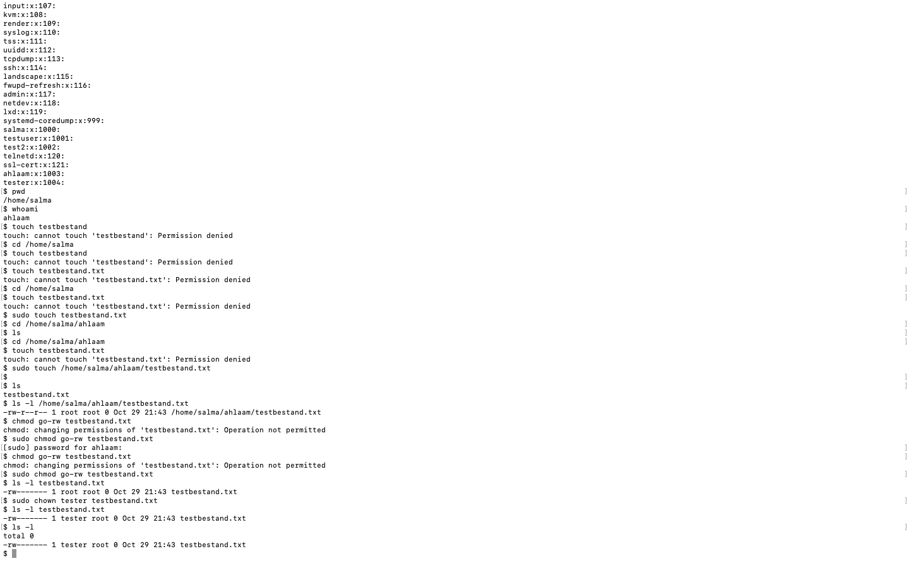

# Files and permission

## Samenvatting
Elk bestand in Linux bevat een reeks machtigingen. Er zijn afzonderlijke machtigingen voor het lezen, schrijven en uitvoeren van bestanden (rwx). Er zijn ook drie soorten entiteiten die verschillende machtigingen kunnen hebben: de eigenaar van het bestand, een groep en iedereen anders. 

Root heeft geen machtigingen nodig om een bestand te lezen, schrijven of uit te voeren.

Je kunt de machtigingen van een bestand bekijken door een lange lijst te maken. De machtigingen van een bestand, evenals de eigenaar en groep, kunnen ook worden gewijzigd.

Elke gebruiker vermeld in /etc/passwd kan worden toegewezen als eigenaar van een bestand.

Elke groep vermeld in /etc/group kan worden toegewezen als de groep van een bestand.

## Opdracht

## Gebruikte bronnen
- https://www.pluralsight.com/blog/it-ops/linux-file-permissions 

