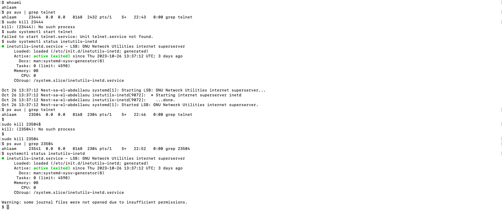

# Processes

## Samenvatting
Processen in Linux kunnen worden onderverdeeld in drie categorieën: Daemons, Services en Programma's.

Een daemon draait op de achtergrond en is niet-interactief. Een service reageert op verzoeken van programma's en kan dus interactief zijn.

Een proces is een instantie van uitgevoerde code. Alle code is ergens op het systeem opgeslagen in bestanden. Om deze bestanden te vinden, kijkt Linux in de $PATH-variabele.

Elk proces heeft zijn eigen PID (Process ID) nummer.

## Key-terms
Daemon: 
Een daemon is een specifiek type proces in een computerbesturingssysteem, zoals Linux en Unix. Het kenmerkende kenmerk van een daemon is dat het op de achtergrond draait, zonder enige directe interactie met gebruikers. Daemons worden vaak gestart bij het opstarten van het systeem en blijven actief gedurende de hele tijd dat het systeem draait, om specifieke taken of services uit te voeren.

*Voorbeelden: H-daemon (sshd) voor beveiligde externe toegang, de Apache-webserverdaemon (httpd) en de cron-daemon (cron) voor geplande taken in Unix-achtige besturingssystemen.*

## Opdracht
Starten van de telnet-daemon, ontdekkken van de PID van de telnet-daemon en ontdekken hoeveel geheugen de telnet-daemon gebruikt. Tot slot: stop of beëindig je het telnet-daemonproces.

## Gebruikte bronnen
- https://www.techtarget.com/whatis/definition/daemon
- https://notes.shichao.io/apue/ch13/
## Ervaren problemen
Deze oefening kostte me best wat tijd om uit te zoeken hoe ik de telnet moest starten. Telnet-daemon proces stoppen was ook best lastig. Hier heb ik dus wat langer over gedaan en veel opgezocht.

## Resultaat
Ik heb met de telnet geoefend en heb geleerd wat mijn struikelblok was geweest. 

