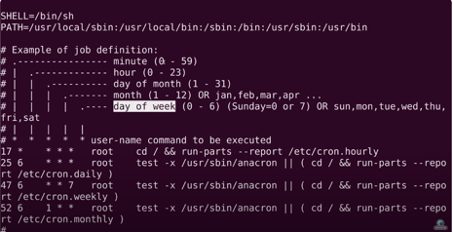

# Cron jobs

## Samenvatting
Er kunnen processen zijn die je op regelmatige basis wilt uitvoeren. Dit soort taken kunnen worden geautomatiseerd met behulp van Cron-taken.

Voorbeeld: 

Bron afbeelding: https://www.youtube.com/watch?v=v952m13p-b4

**Uitleg:**

Eerste kolom staat voor minuten

Tweede kolom staat voor uren 

De derde kolom staat voor de dagen van de maand

Vierde kolom staat voor de maand

Vijfde kolom staat voor de dagen van de week

Hiermee kun je dus de tijd en frequentie aanpassen door de getallen in de cronjob aan te passen aan je specifieke behoeften.

## Opdracht

## Gebruikte bronnen

## Ervaren problem

## Resultaat
