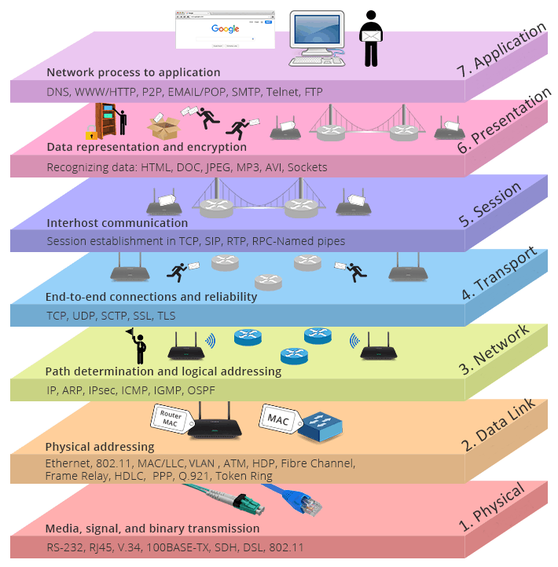

# OSI stack

## Samenvatting
Het Open Systems Interconnection-model (OSI-model) is primair een model dat wordt gebruikt voor het oplossen van problemen in telecommunicatie- of computersystemen.

TCP/IP-model: Dit model beschrijft de standaard waarop het internet is gebouwd.


## Key-terms

**OSI stack:** Het bestaat uit 7 lagen, die elk een ander onderdeel van netwerkcommunicatie vertegenwoordigen. Elke laag heeft verschillende protocollen die eraan zijn gekoppeld.


```
1. Physical Layer: Het zorgt voor de overdracht van ruwe bits over het netwerk.
```
```
2. Data Link Layer: Hier wordt data in frames verdeeld en gecontroleerd op fouten.
```
```
3. Network Layer: Gegevenspakketten routeren tussen verschillende netwerken & gebruik van IP-adressen.
```
```
4. Transport Layer: End-to-end communicatie & controle dat gegevenspakketten correct en betrouwbaar worden afgeleverd.
```
```
5. Session Layer: De sessielaag beheert de communicatie en sessie-uitwisseling tussen twee apparaten.
```
```
6. Presentation Layer: Gegevensindeling en codering geregeld, zodat systemen met verschillende dataformats effectief kunnen communiceren.
```
```
7. Application Layer: Toepassingen en services rechtstreeks met de gebruiker communiceren.
```


## Opdracht
*Vraag 1: Benoem en beschrijf de functies van veelvoorkomende netwerkapparatuur.*

**Router:**
Verbinden verschillende netwerken en leiden gegevenspakketten tussen deze netwerken. Ze beheren IP-adresverdeling en beveiliging tussen het lokale netwerk (LAN) en het bredere internet (WAN).

**Switch:**
Verbinden apparaten binnen hetzelfde lokale netwerk (LAN) en sturen gegevens rechtstreeks naar de doelapparaten op basis van hun MAC-adressen. Ze zorgen voor efficiënte gegevensoverdracht binnen het LAN.

**Access Point (AP):**
Bieden draadloze connectiviteit in een netwerk. Ze zetten bekabelde gegevens om in draadloze signalen en zorgen voor Wi-Fi-toegang.

**Firewall:**
Beveiligen het netwerk door inkomend en uitgaand verkeer te controleren en te filteren op basis van regels. Ze beschermen het netwerk tegen ongeautoriseerde toegang en schadelijke inhoud.

**DHCP-server:**
Wijzen automatisch IP-adressen toe aan apparaten in een netwerk. Dit vereenvoudigt netwerkconfiguratie omdat apparaten geen handmatige IP-configuratie nodig hebben.

**Modem:**
Zet digitale gegevens om in een analoog signaal voor overdracht via koperen lijnen (DSL-modem) of kabels (kabelmodem) en vice versa. Ze zijn essentieel voor het verkrijgen van internettoegang via DSL of kabelverbindingen.

**Proxyserver:**
Fungeren als tussenpersonen tussen gebruikers en internetresources. Ze kunnen de prestaties verbeteren, de veiligheid versterken en toegang tot specifieke inhoud beheren.

**Load Balancer:**
Distribueren netwerkverkeer over meerdere servers om de belasting te verdelen en de prestaties en beschikbaarheid te verbeteren. Ze zijn vaak te vinden in datacenters.

**Network Attached Storage (NAS):**
Bestanden en gegevens opslaan in een netwerk en stellen gebruikers in staat om ze te delen en er toegang toe te krijgen. Ze fungeren als gedeelde opslagbronnen.

**Managed Switch:**
Bieden geavanceerde beheermogelijkheden, waaronder VLAN-ondersteuning, Quality of Service (QoS) en de mogelijkheid om verkeer te controleren en te prioriteren.

**VoIP-telefoon (Voice over Internet Protocol):**
Gebruiken internetprotocollen om spraakcommunicatie via IP-netwerken mogelijk te maken. Ze worden vaak gebruikt voor zakelijke telefoonsystemen.

**Wireless LAN Controller (WLC):**
Beheren en coördineren draadloze toegangspunten in een zakelijk draadloos netwerk. Ze optimaliseren de prestaties en beveiliging van draadloze netwerken.

*Vraag 2: Welke andere informatie heeft de router over aangesloten apparatuur?*

Hostnaam, IP-adres, MAC-adres, verbindingstype, leasetijd, status, upload- en downloadsnelheden en toegangscontrole.

*Vraag 3: Waar staat je DHCP server op jouw netwerk? Wat zijn de configuraties hiervan?*

De DHCP server vind je terug in mijn router (thuisnetwerk).


### Gebruikte bronnen
- https://www.cloudflare.com/learning/ddos/glossary/open-systems-interconnection-model-osi/

- https://www.tutorialspoint.com/difference-between-osi-and-tcp-ip-reference-model

- https://www.geeksforgeeks.org/tcp-ip-model/

- https://community.fs.com/article/tcpip-vs-osi-whats-the-difference-between-the-two-models.html

### Ervaren problemen:

Niet van toepassing.

### Resultaat
Ik heb kennis opgedaan in het OSI-model en TCP/IP model. Tot slot heb ik netwerkapparatuur bestudeerd en mij verdiept in mijn eigen thuisnetwerk.
