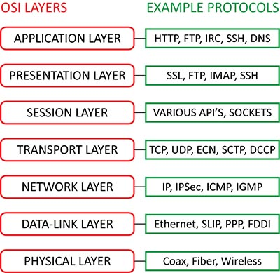

# Protocols

## Samenvatting
De computers binnen een netwerk kunnen aanzienlijk verschillende software en hardware gebruiken; echter, het gebruik van protocollen stelt hen in staat om ongeacht met elkaar te communiceren. 

Zo worden protocollen toegepast in verschillende soorten netwerken en toepassingen. Je kunt de protocollen benadrukken die specifiek van toepassing zijn op lokale netwerken (LANs), wide area networks (WANs), mobiele netwerken, het internet, cloud computing en meer.

## Key-terms
**Wireshark:** Een softwareprogramma dat wordt gebruikt om gegevens op een computernetwerk vast te leggen en te analyseren. Het wordt ook wel een ‘packet sniffer’ of een ‘protocol analyzer’ genoemd.

*Het wordt met name gebruikt door commerciële ondernemingen, overheidsinstanties en non-profitorganisaties om hun netwerk verkeer vast te leggen en te analyseren via een beveiligde verbinding.*

## Opdracht
*Vraag 1: Identificeer verschillende andere protocollen en hun bijbehorende OSI-laag.*

In de onderstaande afbeelding worden een aantal voorbeelden gegeven voor OSI-lagen.

*Vraag 2:*
