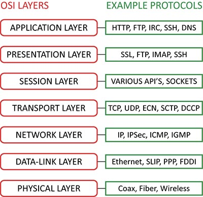

# Protocols

## Samenvatting
De computers binnen een netwerk kunnen aanzienlijk verschillende software en hardware gebruiken; echter, het gebruik van protocollen stelt hen in staat om ongeacht met elkaar te communiceren. 

Zo worden protocollen toegepast in verschillende soorten netwerken en toepassingen. Je kunt de protocollen benadrukken die specifiek van toepassing zijn op lokale netwerken (LANs), wide area networks (WANs), mobiele netwerken, het internet, cloud computing en meer.

## Key-terms
**Wireshark:** Een softwareprogramma dat wordt gebruikt om gegevens op een computernetwerk vast te leggen en te analyseren. Het wordt ook wel een ‘packet sniffer’ of een ‘protocol analyzer’ genoemd.

*Het wordt met name gebruikt door commerciële ondernemingen, overheidsinstanties en non-profitorganisaties om hun netwerk verkeer vast te leggen en te analyseren via een beveiligde verbinding.*

## Opdracht
*Vraag 1: Identificeer verschillende andere protocollen en hun bijbehorende OSI-laag.*

In de onderstaande afbeelding worden een aantal voorbeelden gegeven voor OSI-lagen.

*Vraag 2: Wie bepaalt welke protocollen we gebruiken en wat is nodig om uw eigen protocol te introduceren?*

Wat belangrijk is bij het introduceren van je eigen protocol:

**Doel Definiëren:** Bepaal waarom het protocol nodig is, welke eigenschappen het moet hebben en hoe het zich moet gedragen. Dit omvat het bepalen van gegevensindeling, verzending en interpretatie.

**Ontwikkelen:** Bouw het protocol, meestal in de vorm van software of firmware die kan worden geïnstalleerd op netwerkapparaten of systemen.

**Grondig Testen:** Test het protocol uitgebreid om ervoor te zorgen dat het correct functioneert, betrouwbaar is en geen beveiligingsproblemen veroorzaakt.

**Documenteren:** Maak gedetailleerde documentatie die de werking van het protocol, het gebruik en eventuele beveiligingsoverwegingen beschrijft.

**Implementeren:** Installeer het protocol in de beoogde systemen of apparaten.

**Valideren:** Controleer of het protocol in realistische situaties naar behoren functioneert en voldoet aan de gestelde verwachtingen.

*Vraag 3: Installeer Wireshark en zoek naar een protocolm hoe functioneert dit protocol?*

## Gebruikte bronnen

## Ervaren problemen
Niet van toepassing.

## Resultaat
Ik heb verschillende protocollen geïndentificeerd. Ik heb dit in de praktijk kunnen toepassen door het programma Wireshark te gebruiken.

