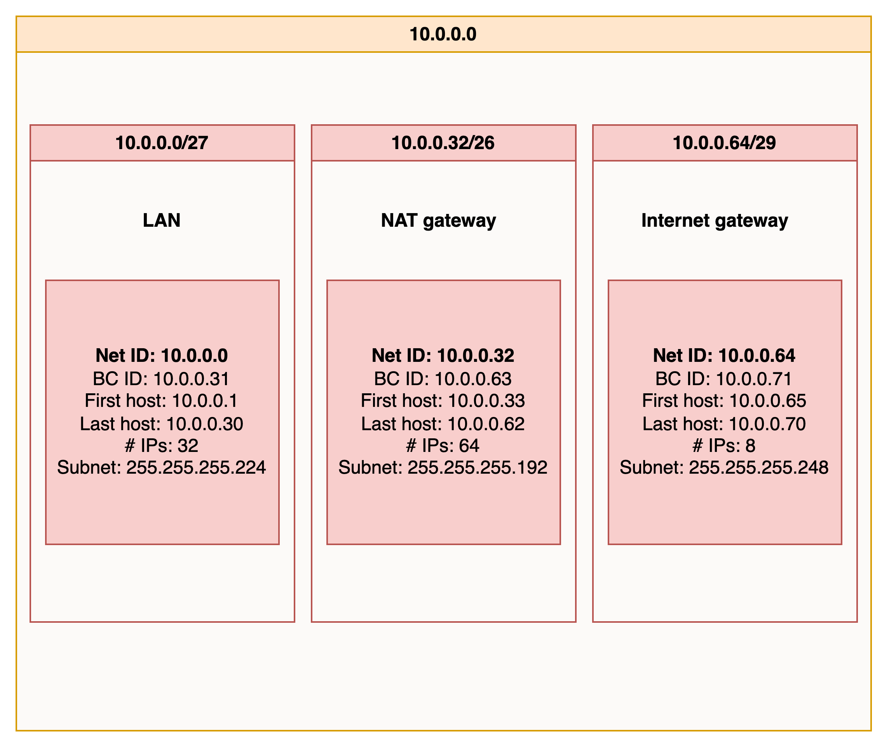

# Subnetting

## Samenvatting
Subnetting: Subnetting verdeelt het netwerk in kleinere delen (subnetten). 

Het IP-adres bestaat dus eigenlijk uit drie componenten: het netwerkdeel, het subnetdeel en ten slotte het hostdeel.

Een subnetmasker geeft gewoon aan hoeveel bits worden “geleend” van de hostcomponent van een IP-adres.

## Opdracht:
Hieronder laat ik zien hoe ik een netwerkarchitectuur maak die voldoet aan de volgende eisen:
- 1 subnet dat alleen van binnen het LAN bereikbaar is. Dit subnet moet minimaal 15 hosts kunnen plaatsen.
- 1 subnet dat internet toegang heeft via een router met NAT-functionaliteit. Dit subnet moet minimaal 30 hosts kunnen plaatsen (de 30 hosts is exclusief de router).
- 1 subnet met een network gateway naar het internet. Dit subnet moet minimaal 5 hosts kunnen plaatsen (de 5 hosts is exclusief de internet gateway).

**Uitleg voorbeeld 10.0.0.0/27:** 

Net ID: Dit is het beginadres van het subnet. In dit geval is het 10.0.0.0 het netwerkadres, wat betekent dat alle IP-adressen in dit subnet zullen beginnen met "10.0.0.".

BC ID: Dit is het laatste adres in het subnet en wordt gebruikt voor uitzendingen naar alle apparaten in het subnet. Hier is het 10.0.0.31 het uitzendadres.

First host: Dit is het eerste bruikbare IP-adres in het subnet, dat meestal wordt gebruikt voor de gateway of router van het subnet. In dit geval is het 10.0.0.1 het eerste bruikbare adres.

Last host: Dit is het laatste bruikbare IP-adres in het subnet, dat beschikbaar is voor apparaten in het subnet. Hier is 10.0.0.30 het laatste bruikbare adres.

IPs: Dit is het totale aantal IP-adressen in het subnet, inclusief het netwerkadres en het uitzendadres. In dit geval zijn er 32 IP-adressen beschikbaar in het subnet.

Subnet (Subnetmasker): Het subnetmasker 255.255.255.224 in binaire notatie is 11111111.11111111.11111111.11100000. Dit betekent dat de eerste 27 bits in het IP-adres de netwerk-ID vertegenwoordigen, en de overige 5 bits zijn beschikbaar voor hostadressen. Hierdoor zijn er 2^5 = 32 mogelijke hostadressen in dit subnet.

## Gebruikte bronnen:
https://www.techopedia.com/nl/8-stappen-om-ip-subnetten-te-begrijpen

https://www.youtube.com/watch?v=BWZ-MHIhqjM

https://www.calculator.net/ip-subnet-calculator.html?cclass=any&csubnet=27&cip=10.0.0.0&ctype=ipv4&x=Calculate

https://www.youtube.com/watch?v=_IOZ8_cPgu8

## Ervaren problemen
Niet van toepassing.

## Resultaat
Ik heb geleerd hoe ik moet subnetting en deze kennis heb ik toegepast in een netwerkarchitectuur die ik in de bovenstaande opdracht heb opgesteld.

In deze configuratie zou je een subnetmasker van 255.255.255.240 kunnen gebruiken, wat betekent dat je 16 IP-adressen hebt (10.0.0.0 tot 10.0.0.15), waarvan 14 bruikbaar zijn voor apparaten (aangezien het eerste en laatste adres meestal worden gereserveerd voor netwerk- en broadcastadressen).

