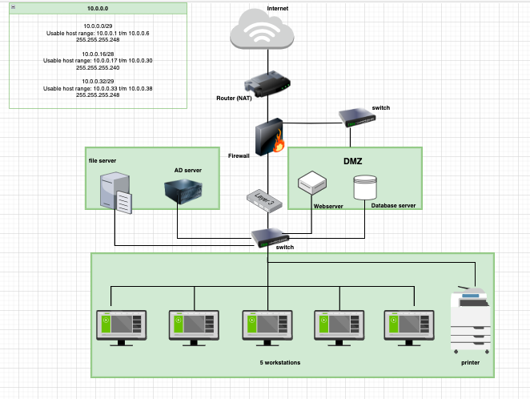

# Network case study

## Opdracht
In deze casestudy neem ik de rol aan van een netwerkbeheerder die een netwerk opzet in het nieuwe kantoor van een klein e-commercebedrijf. Dit bedrijf heeft specifiek aangegeven dat netwerkbeveiliging voor hen uiterst belangrijk is.

Het kantoor bevat de volgende apparaten:
- Een webserver waar onze webwinkel wordt gehost.
- Een database met inloggegevens voor gebruikers op de webwinkel.
5 werkstations voor de kantoormedewerkers.
- Een printer.
- Een AD-server (Active Directory-server).
- Een bestandsserver met interne documenten.

Hieronder laat ik zien welk netwerkarchitectuur ik heb opgesteld:

**Uitleg netwerkarchitectuur:**
- De router fungeert als interface tussen het interne netwerk en het internet met NAT-functie voor uitgaand verkeer.
De firewall beschermt het interne netwerk tegen ongeautoriseerde toegang vanaf het internet.
- AD-server en file server zijn afgezonderd van de interne netwerk, voor een optimale beveiliging en netwerkverkeer.
- De webserver en database server bevinden zich in de DMZ ter beveiliging. Er is beperkte toegang hiervoor.
- Switch 24 port L3: Deze switch fungeert niet alleen als een datalink-layer switch, maar ook als een netwerklaagrouter.
- De printer en de werkstations (5) zijn verbonden met de interne switch.

## Gebruikte bronnen
- https://app.diagrams.net

- https://www.youtube.com/watch?v=ecCuyq-Wprc

## Resultaat
Ik heb de opgedane kennis van deze hele week toegepast in het maken van mijn netwerkarchitectuur voor dit e-commerce bedrijf.