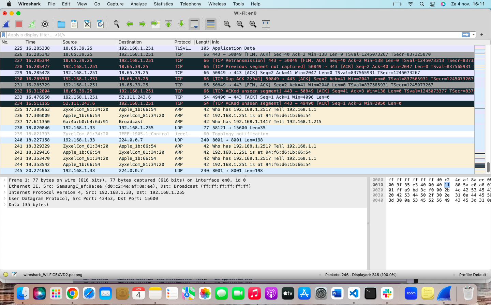

# Netwerk detection

## Samenvatting
## Key-terms
Nmap (Network Mapper) is een hulpmiddel dat een netwerk scant om informatie erover te vinden. Bijvoorbeeld, welke poorten zijn open op een host in je netwerk.

Wireshark is een protocolanalyzer. Het bekijkt netwerkverkeer en toont informatie over pakketten, zoals protocol en bestemming (onder andere dingen).


Voor ik gebruik kan maken van de nmap,   heb ik het eerst geïnstalleerd in mijn VM 
(m.b.v. commando **sudo apt install nmap**)

Enkele veelgebruikte commando opties zijn:

```
-sP: Voert een ping-scan uit om te controleren welke hosts online zijn zonder poorten te scannen.
```
```
-sT: Voert een TCP-connectiescan uit om open TCP-poorten te identificeren.
-sU: Voert een UDP-poortscan uit om open UDP-poorten te identificeren.
```
```
-A: Voert een uitgebreide scan uit om meer details over de host en services te verkrijgen.
```
```
-p: Specificeert welke poorten moeten worden gescand
```

## Opdracht



## Resultaat
Ik heb de netwerk van mijn eigen Linux machine kunnen inspecteren. 
