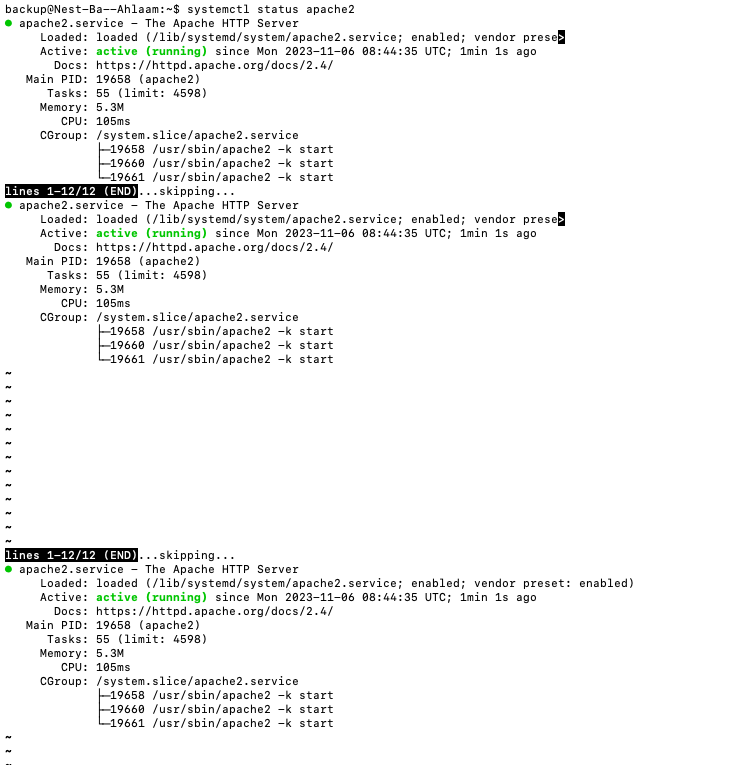
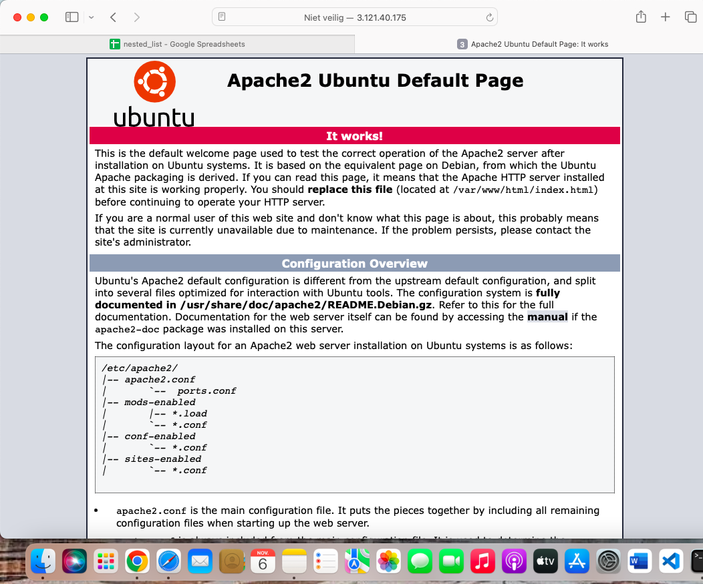
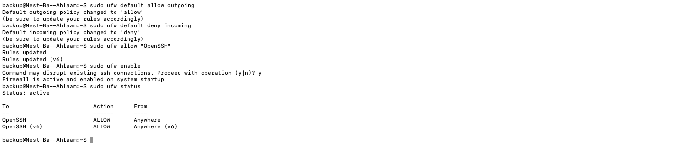
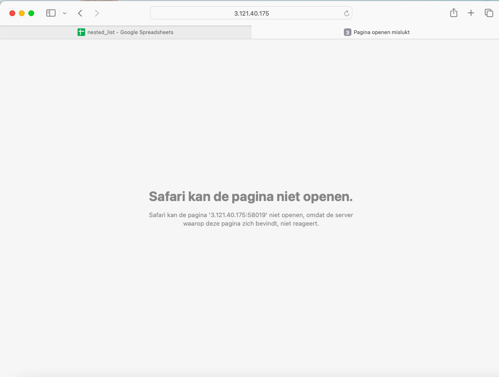

# Firewalls

## Samenvatting
Firewalls zijn software die netwerkverkeer filteren. Een firewall kan dit verkeer filteren op protocol, poortnummer, bron en bestemming van een pakket. Meer geavanceerdere firewalls kunnen ook de inhoud inspecteren om eventuele gevaren te blokkeren.

CentOS en RHEL hebben een standaard firewall daemon (firewalld) geïnstalleerd. Ik maak zelf gebruik van Ubuntu de standaard: `firewall ufw.` Een oudere nog veel voorkomende firewall in Linux is iptables.

## Key-terms
Firewalls kunnen stateful of stateless zijn. Stateful firewalls onthouden de verschillende states van vertrouwde actieve sessies. Hierbij hoeft een stateful firewall niet elke pakketje te scannen voor deze verbindingen.

De verschillende types firewall:
stateful / stateless
hardware / software


## Opdracht
**Opdracht 1: Installeer een webserver op je VM.**

STAP 1:
Ik moet eerst starten met het installeren van de apache2. Dat doe ik door het volgende in mijn VM in te voeren:

```
sudo apt install apache2
```

STAP 2: Vervolgens check ik of dit succesvol is gelukt en of het actief is door het volgende in te voeren:

```
systemctl status apache2
```
*Deze commando wordt gebruikt om de status van de Apache-webserver service te controleren op een systeem met systemd. Het geeft informatie over of de Apache-service actief is, gestopt is, of problemen ondervindt.*



STAP 3: 
```
sudo ufw default allow outgoing
```
*Dit commando stelt het standaardbeleid voor uitgaand verkeer in op "toestaan". Hierdoor wordt alle uitgaand netwerkverkeer standaard toegestaan*

Daarna voer ik ook deze commando in: 
```
sudo ufw default deny incoming
```
Vervolgens voer ik deze commando in:
```
sudo ufw allow "OpenSSH"
```
*Dit commando staat specifiek inkomend SSH-verkeer toe door de serviceprofiel "OpenSSH" te gebruiken.* 

Tot slot om mijn firewall te activeren gebruik ik de volgende commando:
```
sudo ufw enable
```


**Opdracht 2: Bekijk de standaardpagina die met de webserver geïnstalleerd is via je browser op je pc/laptop.**

Uitleg: Na de stappen van opdracht 1 heb ik het IP-adres en webpoort nummer ingevoerd in mijn webbrowser.
```
3.121.40.175:58019
```




Zo ben ik op de standaardpagina die met,de webserver is geinstalleerd, terechtgekomen.

**Opdracht 3: Stel de firewall zo in dat je webverkeer blokkeert, maar wel ssh-verkeer toelaat.**

Uitleg: 

Ik voer de volgende commando in:

```
sudo ufw status
```
*Deze commando geeft informatie over de geïnstalleerde firewallregels, of de firewall is ingeschakeld of uitgeschakeld, en welke poorten zijn toegestaan of geblokkeerd.*

Hieronder zie je dus dat de firewall actief is en dat SSH wel wordt toegelaten.



**Opdracht 4: Controleer of de firewall zijn werk doet.**

Ik herlaad de pagina:
```
3.121.40.175:58019
```
Ik krijg het volgende te zien:
*De server waarop de pagina reageert niet meer.* 

De firewall doet zijn werk dus!



## Gebruikte bronnen
- https://www.cyberciti.biz/faq/how-to-configure-firewall-with-ufw-on-ubuntu-20-04-lts/#Block_ports_with_ufw


## Ervaren problemen
Niet van toepassing.

## Resultaat
Ik heb meer kennis opgedaan over firewalls en heb dit zelf kunnen toepassen in de praktijk met deze opdracht.
