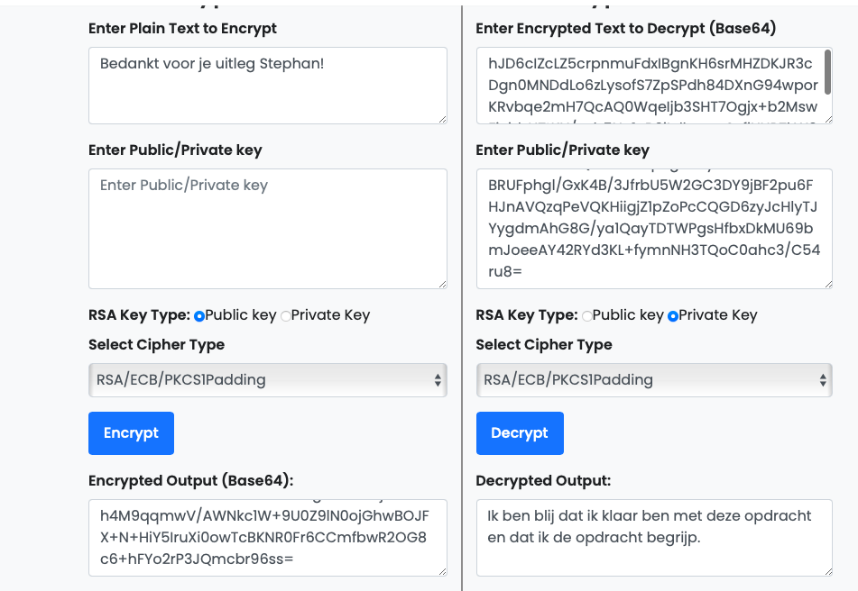
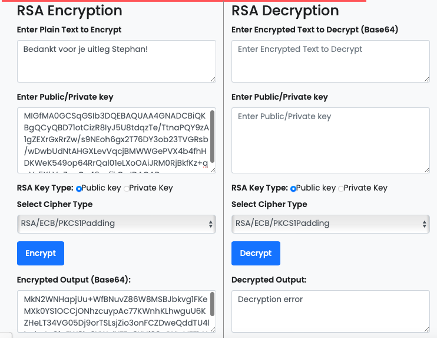

# Asymmetric encryption

## Samenvatting
Asymmetrische encryptie is een vorm van cryptografie waarbij twee verschillende sleutels worden gebruikt: 
`een publieke sleutel en een privésleutel.` 

## Key-terms
**Publieke en Privésleutels:**

Iedere gebruiker genereert een paar sleutels: een publieke sleutel en een privésleutel. De publieke sleutel kan openlijk worden gedeeld, terwijl de privésleutel strikt geheim moet worden gehouden.

**Versleuteling:**

Als iemand een bericht wil verzenden naar een ontvanger, gebruikt de verzender de publieke sleutel van de ontvanger om het bericht te versleutelen. Dit versleutelde bericht kan alleen worden gedecodeerd door de privésleutel van de ontvanger.

**Decryptie:**

De ontvanger gebruikt zijn privésleutel om het versleutelde bericht te decoderen en het oorspronkelijke bericht te lezen. De privésleutel is de enige sleutel die in staat is om de versleutelde gegevens te ontsleutelen.

## Opdracht
Gebruik asymmetrische encryptie om een geheim bericht in een openbare Slack-chat te delen.

## Resultaat
Allereest geneer ik een publieke sleutel en privé sleutel met een online tool (zie gebruikte bronnen). 

**Decryptie:**
Ik heb mijn public key gedeeld met een groepsgenoot. Daarna ontving ik een encryptie van hem in de Slack-chat. 

Zoals je ziet aan de rechterkant van de screenshot, heb ik met behulp van mijn eigen private key zijn encryptie ontsleuteld.

**Encryptie:**
Ik heb de public key van mijn groepsgenoot ontvangen en heb daarmee een encryptie gemaakt. Deze stuurde ik in de Slack-chat.

Zoals je ziet aan de linkerkant van de screenshot, heb ik met behulp van mijn eigen private key zijn encryptie ontsleuteld.

## Gebruikte bronnen
- https://www.devglan.com/online-tools/rsa-encryption-decryption

## Ervaren problemen
Niet van toepassing.
