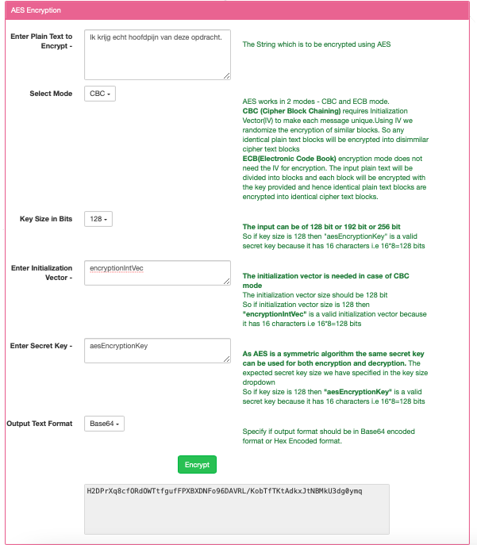
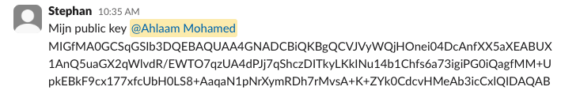
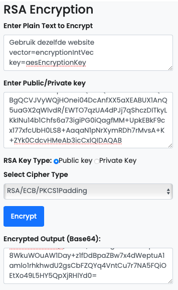
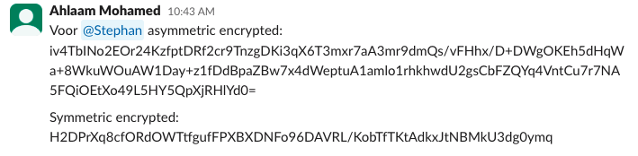

# Symmetric encryption

## Opdracht
Probeer een versleuteld bericht te delen via Slack met een gedeelde sleutel.

Uitleg:

De bedoeling is dat ik een symmetric encrypt naar Stephan stuur zonder dat anderen de sleutel kunnen inzien. Om dit te realiseren kies ik voor een asymmetric encrypt.

**STAP 1: Allereerst maak ik een symmetric encrypt met een sleutel.**



```
Mijn symmetric encrypt: Ik krijg echt hoofdpijn van deze opdracht. 
```

```
Mijn key: aesEncryptionKey
```

Stephan deelt met mij zijn public key:



**STAP 2: Met deze public key kan ik een asymmetric encrypt voor hem maken.**



Ik benoem hierin de instructies en wat de key is, zodat Stephan deze kan gebruiken voor toegang tot het symmetric encrypt.

Hierdoor heeft Stephan nu de sleutel zonder dat anderen dit kunnen zien.

STAP 3: Via Slack heb ik de asymmetric encrypt en symmetric encrypt gedeeld.



## Gebruikte bronnen
- https://www.devglan.com/online-tools/rsa-encryption-decryption

- https://www.javainuse.com/aesgenerator

## Ervaren problemen


## Resultaat
Stephan heeft mijn bericht ontvangen en gelezen.