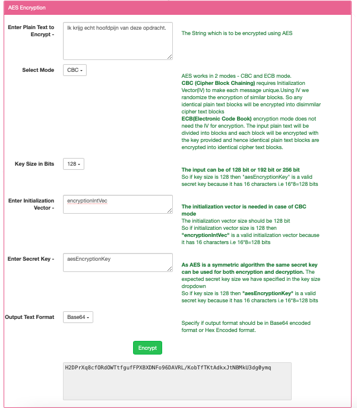
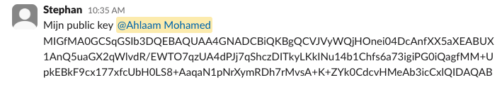
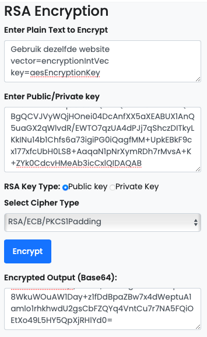
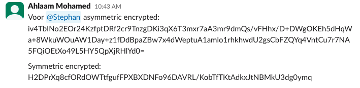

# Symmetric encryption

## Opdracht
Probeer een versleuteld bericht te delen via de openbare Slack-chat met een gedeelde sleutel.

## Resultaat
Ik moet een symmetric encrypt naar mijn groepsgenoot sturen zonder dat de anderen de sleutel kunnen inzien. Om dit te realiseren kies ik voor een asymmetric encrypt om de sleutel te delen met mijn groepsgenoot.

**STAP 1: Allereerst maak ik een symmetric encrypt met een sleutel.**

- Mijn symmetric encrypt: Ik krijg echt hoofdpijn van deze opdracht. 

- Mijn key: aesEncryptionKey

Mijn groepsgenoot heeft zijn public key met mij gedeeld:

**STAP 2: Met deze public key kan ik een asymmetric encrypt voor hem maken.**

Zoals je op de screenshot ziet; benoem ik hierin de instructies en wat de key is, zodat mijn groepsgenoot deze kan gebruiken voor toegang tot het symmetric encrypt.

Hierdoor heeft hij nu de sleutel zonder dat anderen dit kunnen zien.

**STAP 3: Via Slack heb ik de asymmetric encrypt en symmetric encrypt gedeeld.**

Aangezien mijn groepsgenoot de enige is die d.m.v. asymmetric encrypt de key heeft kan hij nu mijn symmetric ontsleutelen. 

## Gebruikte bronnen
- https://www.devglan.com/online-tools/rsa-encryption-decryption

- https://www.javainuse.com/aesgenerator

## Ervaren problemen
Het duurde even voor ik door had op welke manier ik de key kon doorgeven op een veilige manier. 

