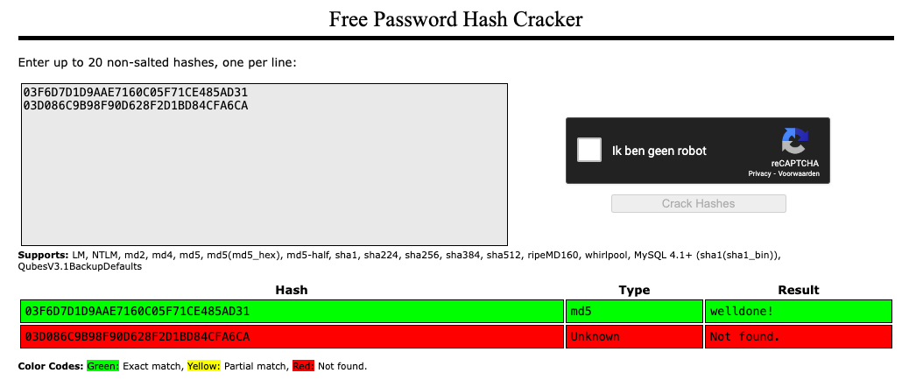
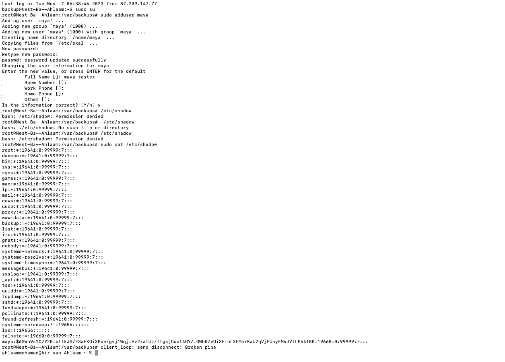
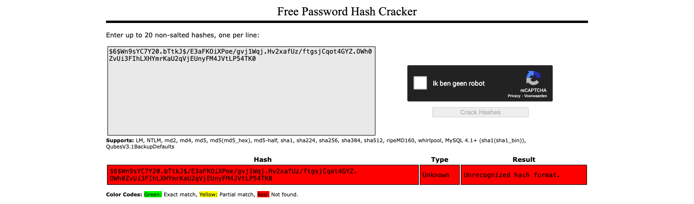
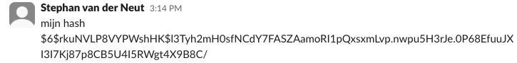

# Passwords

## Samenvatting

## Key-terms
**Hashing**
Een proces om gegevens om te zetten in een vastgelegde reeks tekens voor doeleinden zoals wachtwoordopslag en gegevensintegriteit.

**Salt**
Het "zouten" van een wachtwoord houdt in dat voor elk wachtwoord een unieke willekeurige waarde (het zout) wordt gegenereerd en aan het wachtwoord wordt toegevoegd voordat het wordt gehasht. Dit zorgt ervoor dat zelfs als twee gebruikers hetzelfde wachtwoord hebben, hun gehashte wachtwoorden anders zullen zijn vanwege het unieke zout. Dit beschermt tegen aanvallen zoals Rainbow Tables, omdat elke hash uniek is.

**Pepper**
Het toevoegen van een "peper" aan een wachtwoord is vergelijkbaar met het toevoegen van een extra geheime sleutel aan een wachtwoord voordat het wordt gehasht. Deze peper (een geheime waarde) is niet opgeslagen bij de wachtwoorden maar wordt toegevoegd tijdens het hashproces. Het beschermt tegen aanvallers die toegang hebben tot de gehashte wachtwoorden, omdat ze de geheime peper nodig hebben om de wachtwoorden te kraken.

Beide technieken (peper en zout) dragen bij aan het versterken van de beveiliging van opgeslagen wachtwoorden en maken het moeilijker voor aanvallers om wachtwoorden te kraken.

## Opdracht
1. Ontdek wat hashen is en waarom het de voorkeur heeft boven symmetrische versleuteling voor het opslaan van wachtwoorden. 

2. Ontdek hoe een Rainbow Table kan worden gebruikt om gehashte wachtwoorden te kraken.

3. Er zijn twee MD5-wachtwoordhashes. Probeer beide hashes op te zoeken in een Rainbow Table.

4. Maak een nieuwe gebruiker in Linux aan met het wachtwoord 12345.

5. Om te begrijpen hoe zouten werkt, zoek een medegebruiker met hetzelfde wachtwoord in /etc/shadow en vergelijk de hashwaarden.


## Resultaat
Opdracht 1: Omdat hashing een eenrichtingsproces is, kunnen deze codes niet worden teruggeconverteerd naar de oorspronkelijke gegevens. Zo kunnen de gegevens niet worden ingezien en zijn ze beschermd tegen aanvallen.

Opdracht 2: Het kan worden gebruikt om gehashte wachtwoorden te kraken door de gehashte waarde van een onbekend wachtwoord op te zoeken in de tabel. Als de gehashte waarde overeenkomt met een waarde in de Rainbow Table, kan het overeenkomstige wachtwoord worden geïdentificeerd.

Opdracht 3: 


De eerste hash is een zwak wachtwoord en de andere is een reeks van 16 willekeurig gegenereerde teken.

Opdracht 4:
Ik heb een nieuwe user toegevoegd met de volgende commando:
```
sudo adduser
```



Ik heb de nieuwe gebruiker (maya) wachtwoord 1234 gegeven zoals opgegeven in de opdracht. Met de commando bekijk ik de versleutelde hashes van gebruikers.
```
sudo cat /etc/shadow
```
Ik heb de Rainbow Table gebruikt voor de hash:



Zoals je hierboven ziet is het niet gevonden: Er is namelijk gebruik gemaakt van `salting`. Het gebruik van "zout" in combinatie met gehashte wachtwoorden maakt het aanzienlijk moeilijker om zelfs zwakke wachtwoorden te kraken, omdat de gehashte waarden uniek zijn voor elke gebruiker, en Rainbow Tables houden geen rekening met deze zoutwaarden.

Opdracht 5:
Ik heb dit hash wachtwoord vergeleken met mijn groepsgenoot die hetzelfde wachtwoord heeft voor zijn gebruiker.



Dit is dus anders dan mijn gebruiker's hash. Dit komt dus door het gezouten wachtwoord.


## Gebruikte bronnen  
- https://crackstation.net/

- https://www.adviesjagers.nl/hashing/

- https://www.networkworld.com/article/3629440/how-password-hashing-works-on-your-linux-system.html


## Ervaren problemen
Niet van toepassing.
