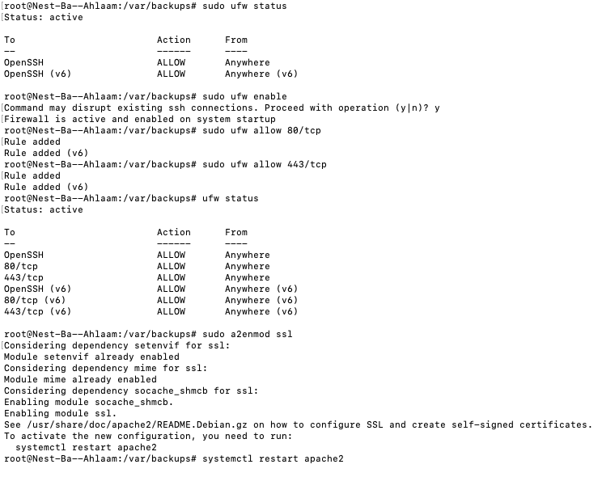
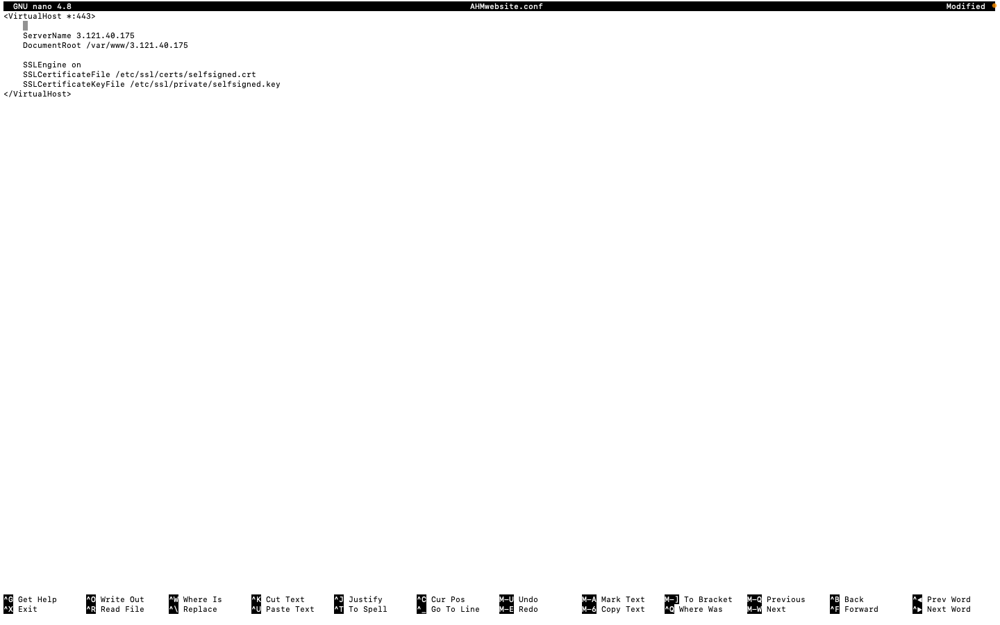
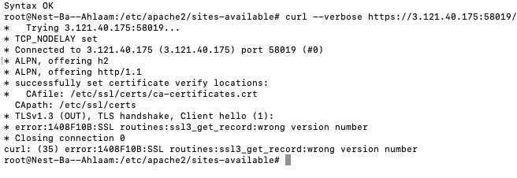
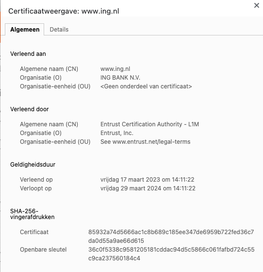
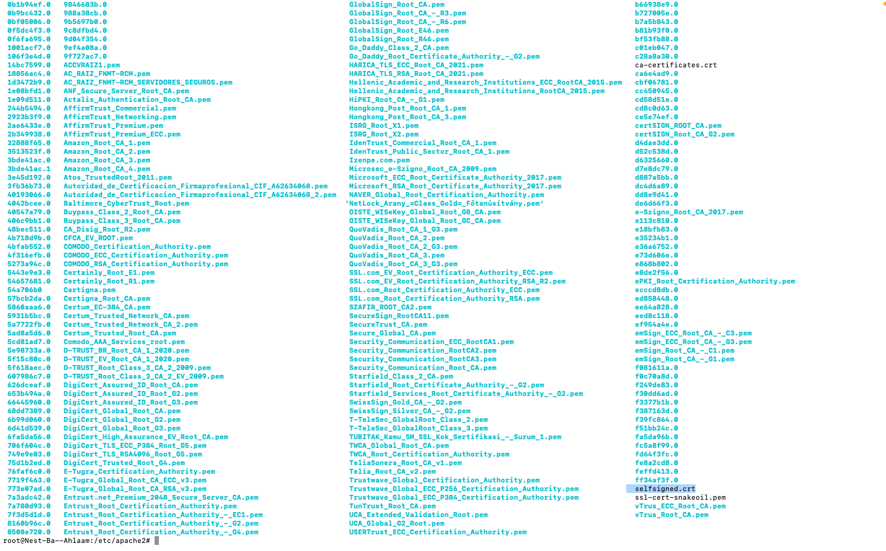

# Public key infrastructure

## Samenvatting
Een Public Key Infrastructure (PKI) is een reeks van rollen, beleidsregels, hardware, software en procedures die nodig zijn om digitale certificaten te creëren, beheren, distribueren, gebruiken, opslaan en intrekken, en om openbare-sleutelencryptie te beheren. Het zorgt ervoor dat je veilig kunt communiceren via een onveilig netwerk, zoals het openbare internet.

X.509 is de standaard die de werking van een PKI definieert. Er zijn verschillende manieren om een PKI te implementeren, maar niet allemaal voldoen aan de X.509-standaard.

## Opdracht
1. Maak een zelfondertekend certificaat op je virtuele machine (VM).
2. Analyseer enkele certificeringspaden van bekende websites.
3. Vind de lijst van vertrouwde certificaat-wortels op je pc/laptop (bonuspunten als je dit ook op je virtuele machine kunt vinden).

## Resultaat
Opdracht 1:

**STAP 1:**  Ik voer de onderstaande commando uit om meer informatie te krijgen over de huidige status van de firewall, inclusief of deze is ingeschakeld of uitgeschakeld.

```
sudo ufw status
```


**STAP 2:** Om poort 80 en 443 in te schakelen en inkomend TCP-verkeer op die poorten toe te staan gebruik ik de volgende commando: 
```
sudo ufw allow 80/tcp
sudo ufw allow 443/tcp
```
Poort 80 en poort 443 worden typisch gebruikt voor onbeveiligde HTTP-verkeer.

**STAP 3: Certificaat aanmaken.**

Door middel van de volgende commando te gebruiken creeër ik een certificaat:

```
sudo openssl req -x509 -nodes -newkey rsa:2048 -keyout /etc/ssl/private/selfsigned.key -out /etc/ssl/certs/selfsigned.crt -days 365
```


**STAP 4: Virtual host**

Om een virtual host configuratiebestand aan te maken gebruik ik de volgende commando: 
```
sudo nano AHM.conf
```
Dit is wat ik in mijn teksteditor heb staan van (mijn AHM.conf bestand):


Door middel van de onderstaande commando wil ik checken of mijn certificaat werkt:


```
curl verboso 3.121.40.175/58019/
```



Opdracht 2: Hieronder zie je het certifcaat van de webiste van ING.



Opdracht 3: Hieronder zie je een lijst met de `trusted CA` in mijn VM. 



Zoals je in de screenshot ziet, staat er de self-signed certification tussen die ik zojuist heb gecreeërd.


## Gebruikte bronnen
- https://www.sslcertificaten.nl/support/OpenSSL/OpenSSL_-_Aanmaken_self-signed_certificaat

- https://www.digicert.com/kb/ssl-support/openssl-quick-reference-guide.htm

## Ervaren problemen