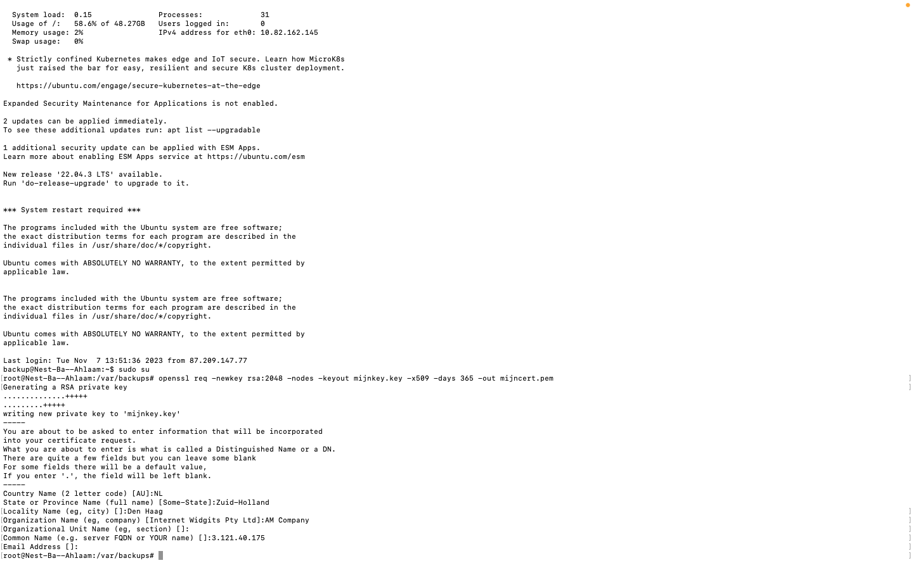

# Public key infrastructure

## Samenvatting
Een Public Key Infrastructure (PKI) is een reeks van rollen, beleidsregels, hardware, software en procedures die nodig zijn om digitale certificaten te creëren, beheren, distribueren, gebruiken, opslaan en intrekken, en om openbare-sleutelencryptie te beheren. Het zorgt ervoor dat je veilig kunt communiceren via een onveilig netwerk, zoals het openbare internet.

X.509 is de standaard die de werking van een PKI definieert. Er zijn verschillende manieren om een PKI te implementeren, maar niet allemaal voldoen aan de X.509-standaard.

## Opdracht
1. Maak een zelfondertekend certificaat op je virtuele machine (VM).
2. Analyseer enkele certificeringspaden van bekende websites.
3. Vind de lijst van vertrouwde certificaat-wortels op je pc/laptop (bonuspunten als je dit ook op je virtuele machine kunt vinden).

## Resultaat
1. Door middel van de volgende commando te gebruiken creeër ik een zelfgemaakte certificaat:

```
openssl req -newkey rsa:2048 -nodes -keyout mijnkey.key -x509 -days 365 -out mijncert.pem
```


2. Met de volgende commando check ik of de certifcaat terug kan vinden:

```
openssl x509 -noout -in /var/backups/mijncert.pem -issuer -subject
```


## Gebruikte bronnen
- https://www.sslcertificaten.nl/support/OpenSSL/OpenSSL_-_Aanmaken_self-signed_certificaat

- https://www.digicert.com/kb/ssl-support/openssl-quick-reference-guide.htm

## Ervaren problemen.