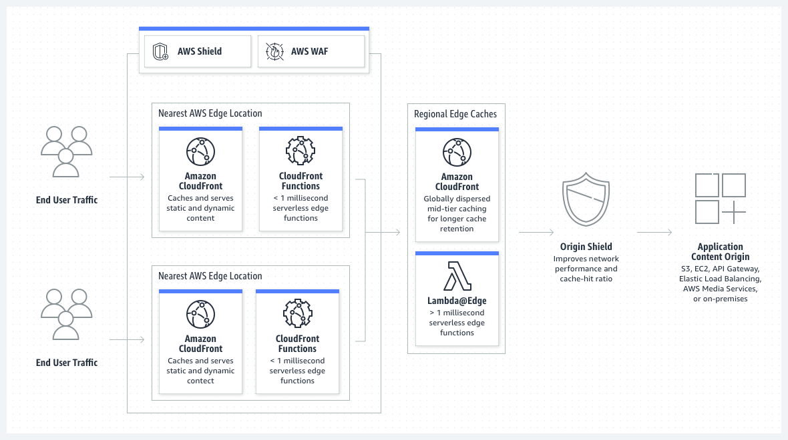
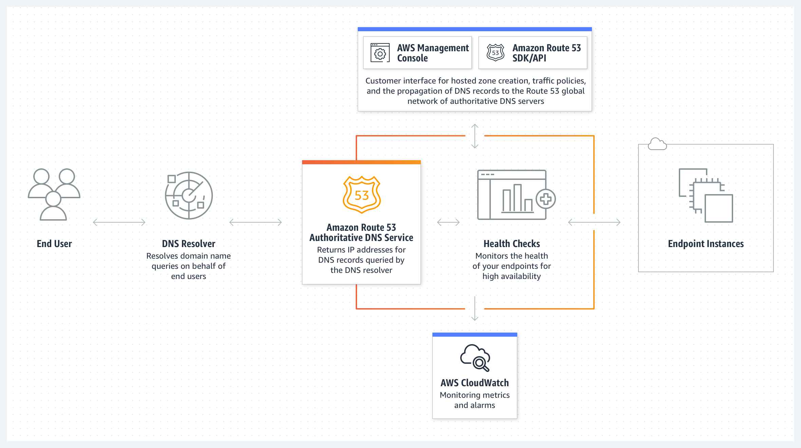

# EFS, EB, CF, R53, RDS
## Introduction

## Exercise
Get practical experience with the following topics:
- EFS
- RDS/Aurora
- Elastic Beanstalk

And gain theoretical understanding on the following topics:
- CloudFront
- Route53

## Results
**Exercise 1: EFS**
I create an EFS file system using Amazon EFS Quick Create.


Under Configure storage, I chose Edit (at bottom right), and then selected `EFS` and `Add shared file system.`
I also created a new shared file system and a file system using Amazon EFS Quick Create.
To enable access to the file system, select `Automatically create and attach security groups`.

Before I launched the EC2 I added the user data that was provided in the exercise that AWS documentation wrote. 

**Summary panel:**


Once it was launched I connected with the EC2 instance and logged in SSH.
To verify that the file system is mounted I used the following command: 
```
df -T
```

To create a file in the file system from the instance I used this command:

```
sudo touch /mnt/efs/test-file.txt
```

To view the file I used the following command:
```
ls /mnt/efs
```
After I am done with the exercise I delete the EFS via https://console.aws.amazon.com/efs/. 

**CloudFront:** Amazon CloudFront is a fast content delivery network (CDN) service that securely delivers data, videos, applications, and APIs to customers globally with low latency, high transfer speeds, all within a developer-friendly environment.



**Route53:** A reliable and cost-effective way to route end users to Internet applications.



## Sources
- https://docs.aws.amazon.com/AWSEC2/latest/UserGuide/AmazonEFS.html