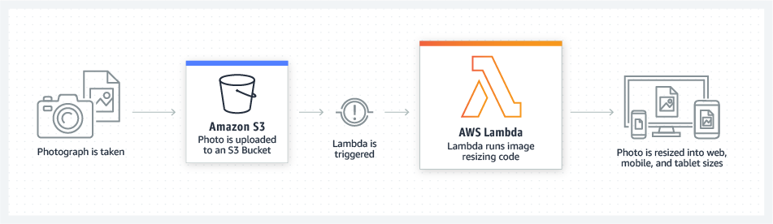

# Lambda
## Introduction
AWS Lambda a serverless compute service.
This service lets you run code without needing to think about servers.

It lets you focus on what's most important, such as making a great application.

`You only pay for the compute time that you use.` Pay for what you use translates to that you only pay when your code is running.

How AWS Lambda works:
1. Deploy your code to Lambda
2. Make the code ready to trigger an event
3. The code only runs when triggered
4. Pay only when your code is running

AWS Lambda can be used to:

1. Build and deploy apps
2. Monitor and maintain apps

Bron afbeelding: https://aws.amazon.com/lambda/ 

## Exercise
Gain practical experience with Lambda.

## Results
**Step 1: Create a Lambda function**

**Step 2: Test the function**

## Sources
- https://www.w3schools.com/aws/aws_cloudessentials_awslambda.php
