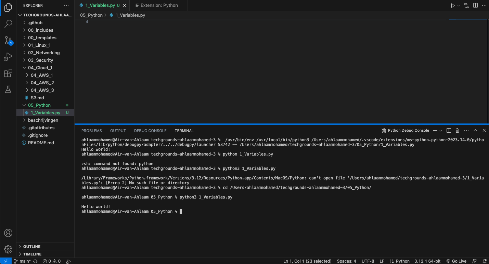
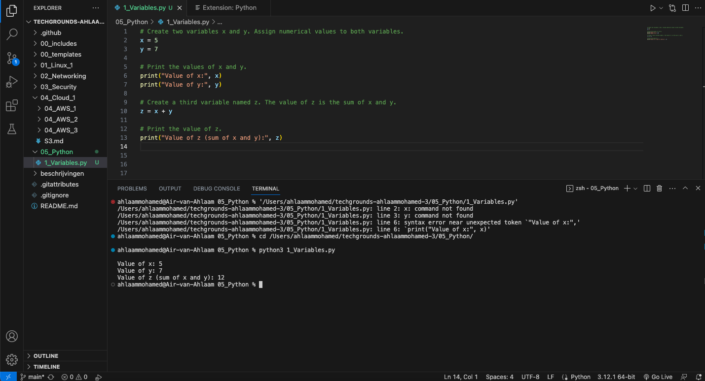
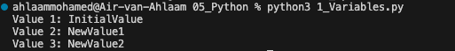

# Variables

## Results
Exercise 1) Write the following Python code: ``print("Hello world!")``

Exercise 2) Create a new script, create two variables x and y. Assign a numerical value to both variables, print the values of x and y.
Create a third variable named z, the value of z should be the sum of x and y, print the value of z.

Exercise 3) Create a new script.
Create a variable and assign a value to it.
Print the text “Value 1: VALUE1”.
Change the value of that same variable.
Print the text “Value 2: VALUE2”.
Change the value of that same variable.
Print the text “Value 3: VALUE3”.

