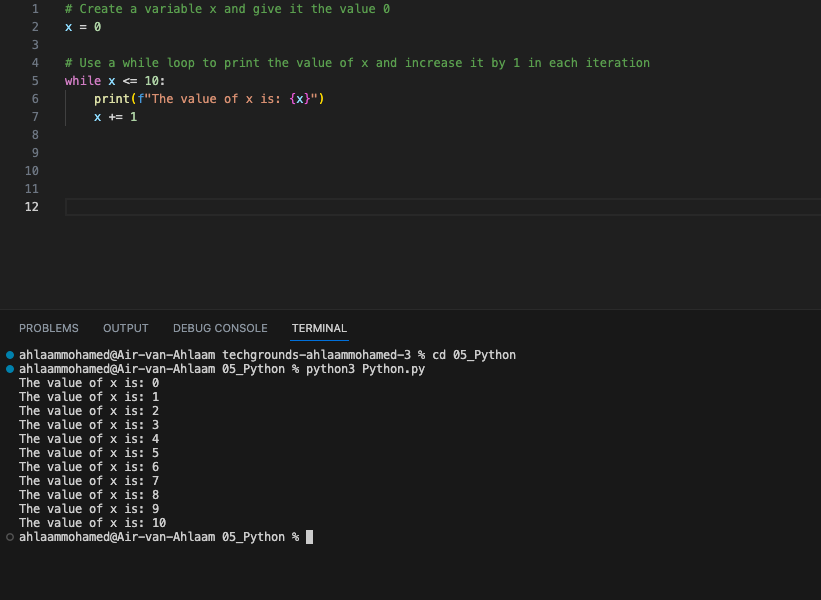

## Results
Exercise 6: Create a new script.
Create a variable x and give it the value 0.
Use a while loop to print the value of x in every iteration of the loop. After printing, the value of x should increase by 1. The loop should run as long as x is smaller than or equal to 10.

**Exercise 7:**
Create a new script.
Copy the code below into your script.

for i in range(10):
#do something here

Print the value of i in the for loop. You did not manually assign a value to i. Figure out how its value is determined.
Add a variable x with value 5 at the top of your script.
Using the for loop, print the value of x multiplied by the value of i, for up to 50 iterations.

**Exercise 8:**
Create a new script.
Copy the array below into your script.
arr = ["Shikha", "Casper", "Bart", "Ruben", "Ulviye"]

Use a for loop to loop over the array. Print every name individually.

