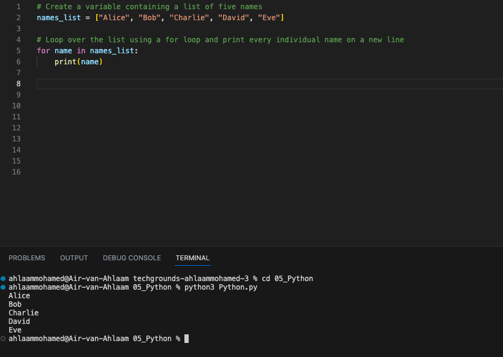
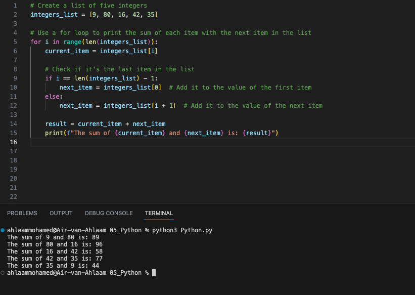

# Lists
## Introduction
You can declare a list of values in a single variable. A list is represented by square brackets [ ], and each value is separated by a comma.

Each position in a list has a number associated with it called the index. Indexes start at 0, so the first item in a list will have the index 0. The second item will have index 1, etc. You can call individual items in a list by calling its index.

You can loop over a list using a for loop. Instead of a number within a range, i (or whatever you name the variable you declare) will have the value of an item in the list. You can still use range() to loop over a list. In this case, i will be used to call an index in a list.

## Results
**Exercise 14:** Create a variable containing a list of five names
names_list = ["Alice", "Bob", "Charlie", "David", "Eve"]

Loop over the list using a for loop and print every individual name on a new line
for name in names_list:
    print(name)

**Exercise 15:** Create a new script.
Create a list of five integers.
Use a for loop to do the following for every item in the list:
Print the value of that item added to the value of the next item in the list.
If it is the last item, add it to the value of the first item instead (since there is no next item).

