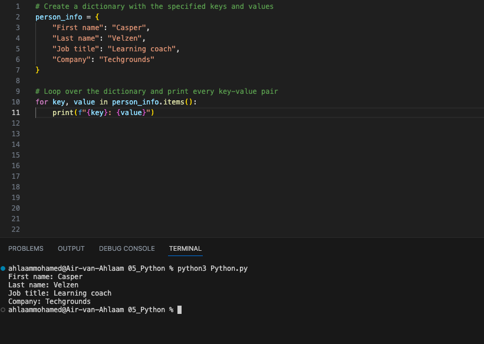
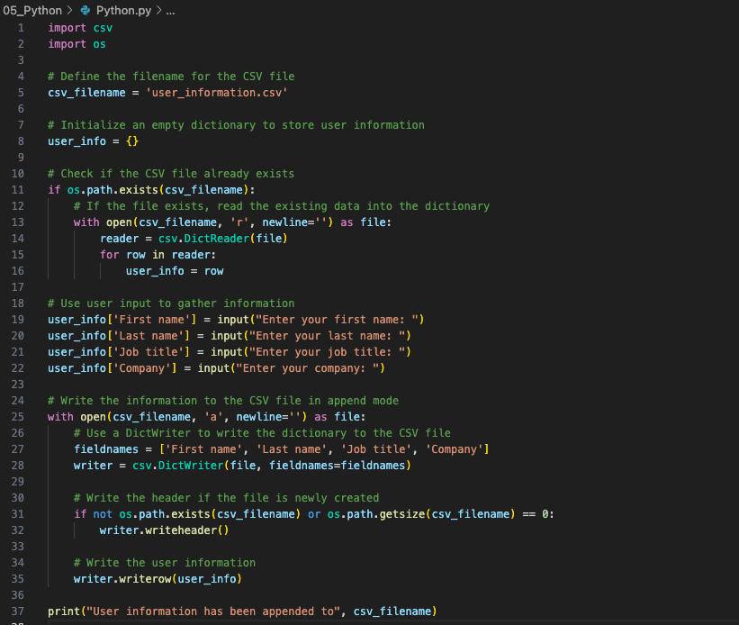

# Key-value pairs
## Introduction
Key-value pairs are a general concept you will definitely encounter. Some examples of where you will find them are NoSQL databases or AWS/Azure resource tags. Dictionaries (dict) in Python also use key-value pairs to store information. Dicts in Python are written using curly brackets {}. You can get values from the dict by calling its key.

## Results 
**Exercise 16:** Create a new script.
Create a dictionary with the keys and values in Techgrounds's Learnworld.
Loop over the dictionary and print every key-value pair in the terminal.

**Exercise 17:** Create a new script.
Use user input to ask for their information (first name, last name, job title, company). Store the information in a dictionary.
Write the information to a csv file (comma-separated values). The data should not be overwritten when you run the script multiple times.

